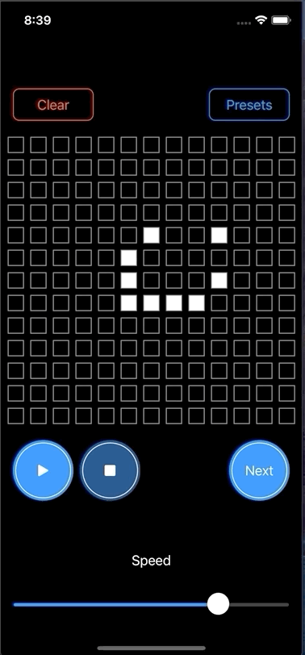

# SwiftUI example of the 'Life of Game'

## TODO

- [ ] Feature: Save to presets
- [x] Support Dark mode
- [ ] Support Mac app
- [ ] Support iPad app (apply proper layout)
- [ ] UITests

## Architecture

Like MVVM.

## Dependency

- [YusukeHosonuma/LifeGame](https://github.com/YusukeHosonuma/LifeGame)

## Author

Yusuke Hosonuma / [@tobi462](https://twitter.com/tobi462)

## License

MIT license.
