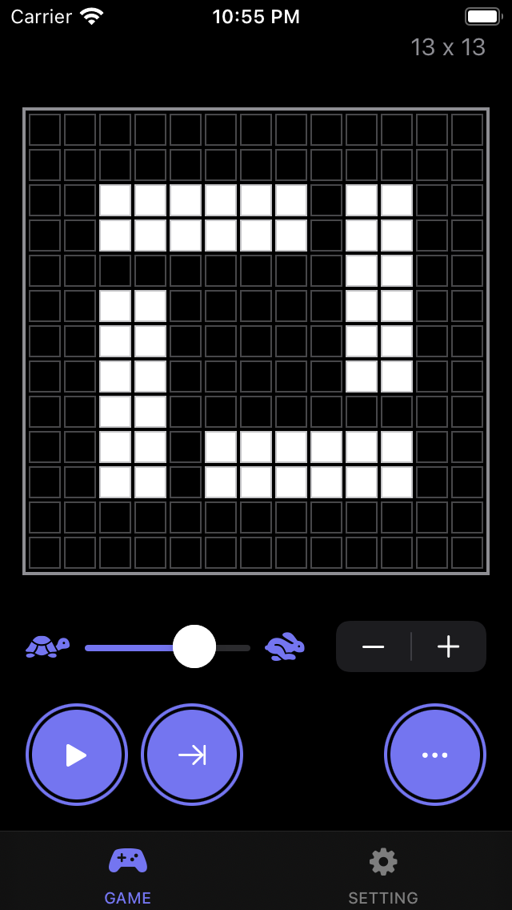
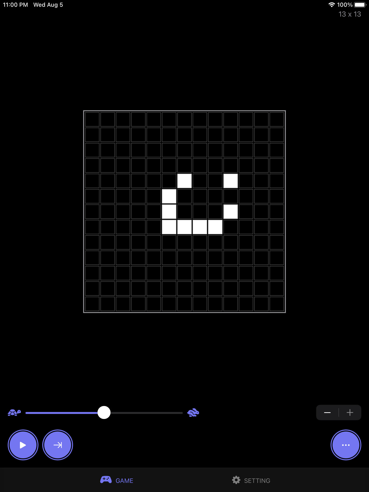
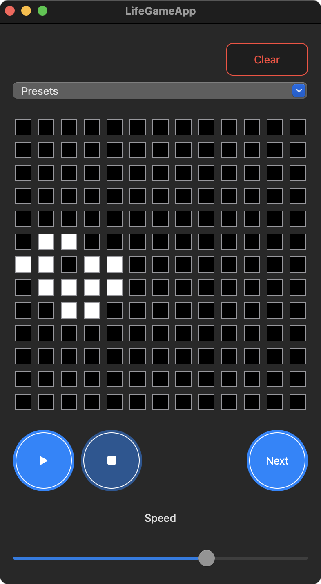

# SwiftUI-LifeGame

The Conway's Game of Life that build with SwiftUI.

|iOS|iPad|macOS|
|--|--|--|
||||

## Requirements

- Xcode 12 (beta 4)
- macOS Catalina
  - **macOS Big Sur is required when build macOS app**

**Important:**

Not included `GoogleService-Info.plist` that is needed to access to Firebase currently.
This will be added in the near future.

## Dependency

- [YusukeHosonuma/LifeGame](https://github.com/YusukeHosonuma/LifeGame)

## Author

Yusuke Hosonuma / [@tobi462](https://twitter.com/tobi462)
