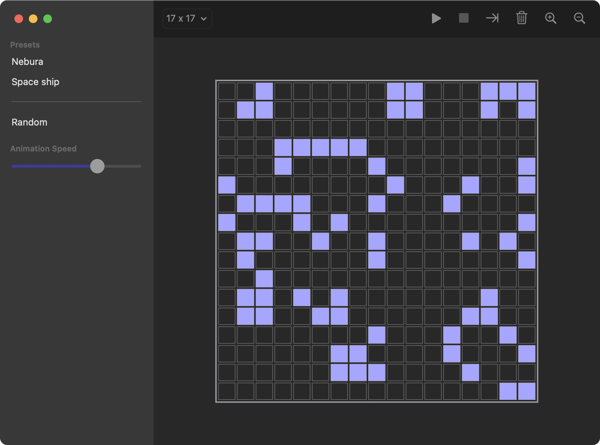

# SwiftUI-LifeGame

The Conway's Game of Life that build with SwiftUI.

|iOS|iPad|macOS|
|--|--|--|
||||

## Requirements

- Xcode 12.2 (beta 2)
- macOS Catalina
  - **macOS Big Sur (beta 9) is required when build and run macOS app**

## Development

Open `LifeGameApp.xcodeproj` then build `LifeGameApp (iOS)` or `LifeGameApp (macOS)` scheme.  
(Please change signing settings when neeeded)

## Dependency

- [YusukeHosonuma/LifeGame](https://github.com/YusukeHosonuma/LifeGame)

## Author

Yusuke Hosonuma / [@tobi462](https://twitter.com/tobi462)
